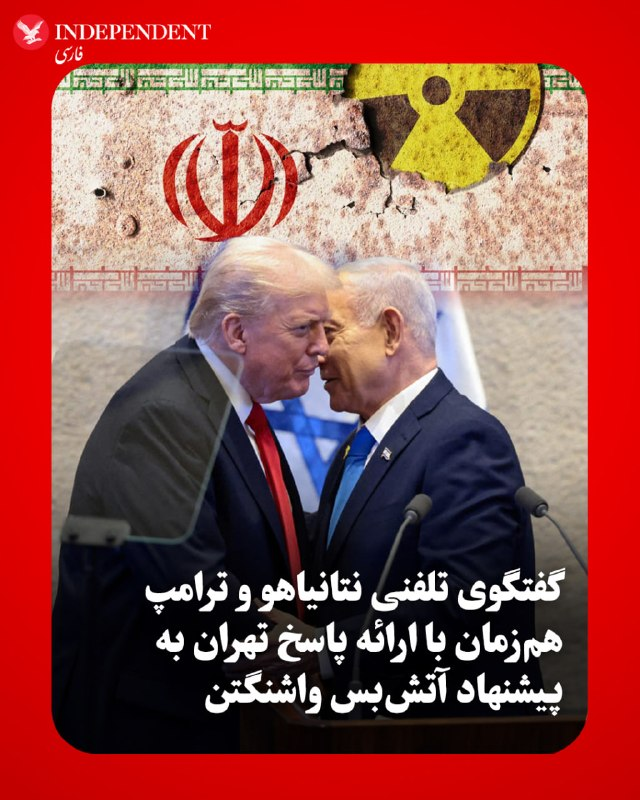
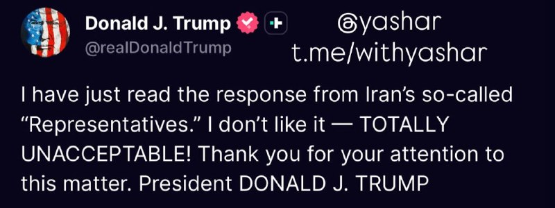
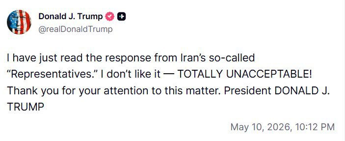
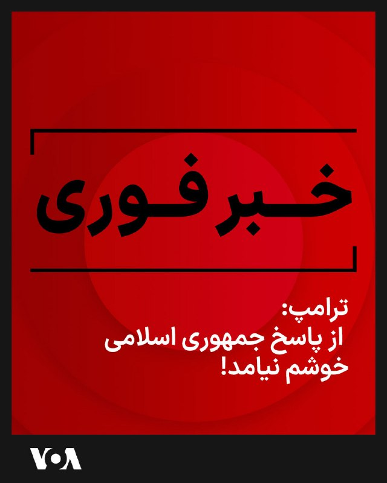

# خواننده تلگرام

<!-- TOP_NAV START -->

<!-- TOP_NAV END -->

<!-- MSG START -->

---
📅 بروزرسانی: 1405/02/20 23:52
---

## VahidOOnLine — post 239381

  

العربیه به نقل از منابع آگاه گزارش داد که پاسخ جمهوری اسلامی به آمریکا، سرنوشت اورانیوم غنی‌شده در ایران را به موفقیت مذاکرات گره زده و در صورت موفقیت مذاکرات میان تهران و واشینگتن، اورانیوم غنی‌شده از ایران منتقل خواهد شد.

بر اساس این گزارش، «معضل اورانیوم غنی‌شده ایران شاهد گام‌هایی برای حل‌وفصل آن بوده است.»

منابع آگاه العربیه گفتند که «هیچ صحبتی درباره برچیدن تاسیسات هسته‌ای در ایران مطرح نیست، اما این تاسیسات تحت نظارت آژانس بین‌المللی انرژی اتمی قرار خواهند گرفت.»

منابع العربیه ادامه دادند که احتمال انتقال اورانیوم ایران به کشوری غیر از آمریکا با درصد بالایی مطرح است اما انتقال اورانیوم غنی‌شده ایران به خارج از کشور، به زمان و اقدامات لازم برای اعتمادسازی نیاز دارد.

منابع العربیه افزودند که هنوز هیچ پاسخی از سوی آمریکا به میانجی پاکستانی تحویل داده نشده است.

پس از انتشار گزارش العربیه، تسنیم خبرگزاری وابسته به سپاه به نقل از یک منبع مطلع نوشت: «گزارش‌ها درباره متن پیشنهادی جمهوری اسلامی در مذاکرات با آمریکا در بخش‌های مهمی با واقعیت منطبق نیست و ادعاهای مطرح‌شده درباره مواد هسته‌ای واقعیت ندارد.»
‌🏁 🇬🇧 IranintlTV

🤖 @VahidOOnLine

## VahidOOnLine — post 239380

  

♦️به گزارش سی‌ان‌ان، منابع اسرائیلی و مقامات آگاه با تایید تماس تلفنی دونالد ترامپ، رئیس جمهوری آمریکا و بنیامین نتانیاهو، نخست‌وزیر اسرائیل، اعلام کردند که این گفتگو هم‌زمان با ارائه پاسخ تهران به آخرین پیشنهاد آتش‌بس آمریکا صورت گرفته است. تصاویر منتشر شده در شبکه‌های اجتماعی نشان می‌دهد که نتانیاهو در حین نشست با رهبران جوامع دروزی و چرکسی، با عذرخواهی جلسه را ترک کرده و اعلام کرده است که باید به تماس تلفنی با ترامپ پاسخ دهد. نتانیاهو در مصاحبه‌ای با برنامه «۶۰ دقیقه» شبکه «سی‌بی‌اس» که روز یکشنبه پخش شد، تاکید کرد که در رابطه با موضوع ایران «کارهای زیادی برای انجام دادن باقی مانده است.»
نخست‌وزیر اسرائیل همچنین در این مصاحبه گفت که ترامپ با او درباره اهمیت حیاتی از بین بردن ذخایر اورانیوم با غنای بالای تهران توافق نظر دارد؛ موضوعی که یکی از محورهای اصلی تلاش‌های واشنگتن در مذاکرات اخیر بوده است. این تماس در حالی انجام شده که ایالات متحده و اسرائیل به طور منظم در حال رایزنی برای پیشبرد مذاکرات آتش‌بس و مقابله با تهدیدات هسته‌ای جمهوری اسلامی هستند. کاخ سفید هنوز به درخواست‌ها برای اظهارنظر رسمی درباره جزئیات این گفتگو پاسخ نداده است.
‌🇸🇦 Indypersian

🤖 @VahidOOnLine

## WithYashar — post 10882

  

من همین الآن پاسخِ به‌اصطلاح «نمایندگان» ایران را خواندم. از آن خوشم نیامد کاملاً غیرقابل‌قبول است!

از توجه شما به این موضوع سپاسگزارم.

رئیس‌جمهور دونالد جی. ترامپ
@withyashar

## mwarmonitor — post 8857

  

🚨خبر فوری 🚨رئیس‌جمهور ترامپ در یک تماس تلفنی به من گفت که از پاسخ اخیر ایران به پیش‌نویس توافق برای پایان دادن به جنگ «خوشش نیامده است». او گفت: «این پاسخ نامناسب بود.» باراک راوید خبرنگار آکسیوس @mwarmonitor

## mwarmonitor — post 8856

شک نکنید بعد از خوندن جواب جمهوری اسلامی این متن نوشته

## mwarmonitor — post 8855

«رو کانا»، آن عضو فاسد مجلس و چپ‌گرای رادیکال از ایالت شکست‌خورده کالیفرنیا، نباید اجازه حضور در فاکس‌نیوز را داشته باشد؛ مگر اینکه مجری‌ای روبروی او باشد که بتواند دروغ‌هایش را یکی پس از دیگری به چالش بکشد و روایت‌های جعلی (اراجیف!) او را متوقف کند. او شبیه به حکیم جفریس، اما بدتر از اوست، فقط با ضریب هوشی کمی بالاتر.
امروز صبح او به نمایندگی از «احمق‌کرات‌ها» (Dumacrats) سعی کرد اعتبار بازگشت صنعت فولاد به ایالات متحده را به نام خودشان بزند؛ در حالی که به خوبی می‌داند آن احمق‌ها عملاً این صنعت را نابود کرده بودند و من بودم که با تعرفه‌های سنگین (و فراتر از آن!) نجاتش دادم.
کشور ما در طول «دولت» قبلی مُرده بود، و حالا داغ‌تر و پررونق‌تر از همیشه است. ما نمی‌توانیم اجازه دهیم «احمق‌کرات‌ها» اعتبار این دستاورد را بدزدند. اگر آن‌ها انتخاب شوند، ملت شکوفا و اکنون بسیار محترم ما را کاملاً نابود خواهند کرد. من اجازه نخواهم داد این اتفاق بیفتد!!!

رئیس‌جمهور دونالد جی. ترامپ

@mwarmonitor

## pm_afshaa — post 90502

🔴ترامپ: از پاسخ ایران اصلا راضی نیستم. به هیچ وجه قابل قبول نیست

💧 Rainbet.com the #1 Non-KYC Crypto Casino & Sportsbook @rainbetcom

😁 @Pm_Afshaa

## pm_afshaa — post 90501

🔴وال استریت ژورنال: به گفته منابع، ایران برچیدن تأسیسات هسته‌ای خود را رد کرده

💧 Rainbet.com the #1 Non-KYC Crypto Casino & Sportsbook @rainbetcom

😁 @Pm_Afshaa

## VahidOnline — post 75389

  

روزنامه وال‌استریت ژورنال، شامگاه یکشنبه ۲۰ اردیبهشت ماه، به نقل از منابعی آگاه، جزئیاتی از پاسخ ایران به پیشنهاد صلح آمریکا را منتشر کرد.

به گزارش این روزنامه، پاسخ ایران که از طریق پاکستان به‌عنوان میانجی به واشنگتن منتقل شده، همچنان اختلاف‌های مهمی میان دو طرف باقی گذاشته است.

به گفته منابع وال‌استریت ژورنال، تهران حاضر نشده از پیش درباره سرنوشت برنامه هسته‌ای خود و ذخایر اورانیوم با غنای بالا تعهد بدهد.

ایران پیشنهاد کرده مسائل هسته‌ای طی ۳۰ روز آینده مورد مذاکره قرار گیرد.

مقامام‌های ایران همچنین برای رقیق‌سازی بخشی از اورانیوم غنی‌شده و انتقال بخش دیگری از آن به یک کشور ثالث اعلام آمادگی کرده‌اند.

وال‌استریت ژورنال گزارش داد تهران با برچیدن تاسیسات هسته‌ای خود مخالفت کرده، اما در عین حال آمادگی‌اش را برای تعلیق غنی‌سازی اورانیوم اعلام کرده است؛ تعلیقی که به گفته این روزنامه، مدت آن کوتاه‌تر از توقف ۲۰ ساله پیشنهادی آمریکا خواهد بود.

بر اساس این گزارش، ایران در پاسخی چندصفحه‌ای به تازه‌ترین پیشنهاد آمریکا برای پایان دادن به جنگ، خواستار پایان درگیری‌ها و لغو محاصره کشتی‌ها و بنادر ایرانی شده و پیشنهاد داده است تنگه هرمز به‌تدریج به روی رفت‌وآمد تجاری باز شود.

وال‌استریت ژورنال نوشت ایران در مقابل، خواستار تضمین‌هایی شده است که اگر مذاکرات شکست بخورد یا آمریکا در آینده از توافق خارج شود، اورانیوم منتقل‌شده دوباره به ایران بازگردانده شود.
@VahidOOnLine

📡 @VahidOnline

## VahidOnline — post 75388

  

رسانه‌های ایران شامگاه یک‌شنبه با اشاره به شنیده شدن فعالیت پدافند هوایی در اندیمشک و شمال دزفول از سرنگونی «پرنده متخاصم دشمن» در اندیمشک خبر دادند.

شهروندان نیز یک‌شنبه ساعت حدود ۱۰ شب از شنیده‌شدن صدای پدافند در این شهر خبر دادند.
@VahidOOnLine

📡 @VahidOnline

## kianmeli1 — post 87337

  

🔴ترامپ: من همین الان پاسخ به اصطلاح «نمایندگان» ایران را خواندم. این را دوست ندارم — کاملاً غیرقابل قبول است! از توجه شما به این موضوع سپاسگزارم.
https://t.me/kianmeli1

## IranIntlTV — post 336531

  

العربیه به نقل از منابع آگاه گزارش داد که پاسخ جمهوری اسلامی به آمریکا، سرنوشت اورانیوم غنی‌شده در ایران را به موفقیت مذاکرات گره زده و در صورت موفقیت مذاکرات میان تهران و واشینگتن، اورانیوم غنی‌شده از ایران منتقل خواهد شد.

بر اساس این گزارش، «معضل اورانیوم غنی‌شده ایران شاهد گام‌هایی برای حل‌وفصل آن بوده است.»

منابع آگاه العربیه گفتند که «هیچ صحبتی درباره برچیدن تاسیسات هسته‌ای در ایران مطرح نیست، اما این تاسیسات تحت نظارت آژانس بین‌المللی انرژی اتمی قرار خواهند گرفت.»

منابع العربیه ادامه دادند که احتمال انتقال اورانیوم ایران به کشوری غیر از آمریکا با درصد بالایی مطرح است اما انتقال اورانیوم غنی‌شده ایران به خارج از کشور، به زمان و اقدامات لازم برای اعتمادسازی نیاز دارد.

منابع العربیه افزودند که هنوز هیچ پاسخی از سوی آمریکا به میانجی پاکستانی تحویل داده نشده است.

پس از انتشار گزارش العربیه، تسنیم خبرگزاری وابسته به سپاه به نقل از یک منبع مطلع نوشت: «گزارش‌ها درباره متن پیشنهادی جمهوری اسلامی در مذاکرات با آمریکا در بخش‌های مهمی با واقعیت منطبق نیست و ادعاهای مطرح‌شده درباره مواد هسته‌ای واقعیت ندارد.»

## IranIntlTV — post 336530

  <a href="https://t.me/IranintlTV/336530" target="_blank">📎 Download file</a>

🎧نسخه صوتی چشم‌انداز: جنون نظامی تازه سپاه و مجتبی در خلیج فارس
@iranintlTV

## Shin_Persian — post 5943

  

Shin ✓ @hey_itsmyturn
Sun, 10 May 2026 20:15:16 UTC

President Trump @POTUS:
"I have just read the response from Iran’s so-called “Representatives.” I don’t like it — TOTALLY UNACCEPTABLE! Thank you for your attention to this matter. President DONALD J. TRUMP"

فارسی

رئیس‌جمهور ترامپ @POTUS:

«من همین حالا پاسخ به اصطلاح «نمایندگان» ایران را خواندم. از آن خوشم نمی‌آید — کاملاً غیرقابل قبول است! از توجه شما به این موضوع سپاسگزارم. رئیس‌جمهور دونالد جی. ترامپ»

𝕏 · @shin_persian

## FarsiVOA — post 217372

  

⚡️دونالد ترامپ: «من همین الان پاسخ به‌اصطلاح نمایندگان [جمهوری اسلامی] ایران را خواندم. از آن خوشم نیامد. کاملاً غیرقابل‌قبول است! از توجه شما به این موضوع سپاسگزارم.»
@FarsiVOA

## Persian_Trend_Official — post 13858

  <a href="telegram/content/Persian_Trend_Official_13858_1778444577.webm" target="_blank">🎬 Download video</a>

💢من همین الان پاسخ ایران از طرف «نمایندگان» به اصطلاح‌شان را خواندم. خوشم نیامد — کاملاً غیرقابل قبول است!

از توجه شما به این موضوع متشکرم.

دونالد جی. ترامپ

🫆:Tony

📌 @persian_trend_official
پرشین ترند | متفاوت‌ترین کانال نظامی

## Persian_Trend_Official — post 13857

طیفهای مختلف نگاه سیاسی وجود داره مثل ارزشی - طرفدار جمهوری اسلامی طرفداران مجاهدین جمهوری خواهان کمونیستها توده ایها چپیها سوسیالیستها سلطنت طلبان فدرالیستها تجزیه طلبها اتحادطلبها آنارشیستها و موارد دیکه به عنوان یک تورکولوژیست دانشجوی ارشد علوم سیاسی و…

## Persian_Trend_Official — post 13856

طیفهای مختلف نگاه سیاسی وجود داره
مثل
ارزشی - طرفدار جمهوری اسلامی
طرفداران مجاهدین
جمهوری خواهان
کمونیستها
توده ایها
چپیها
سوسیالیستها
سلطنت طلبان
فدرالیستها
تجزیه طلبها
اتحادطلبها
آنارشیستها
و موارد دیکه

به عنوان یک تورکولوژیست دانشجوی ارشد علوم سیاسی و روابط بین الملل و رتبه یک رشته زبان و ادبیات ترکی ایران با کمال افتخار یک تجزیه طلب هستم یعنی به عبارت دیگر یک استقلال طلب که اتفاقا تزم هم کمک به استقلال ملتمون در ایران یعنی ملت تورک و البته سایر ملتها از زیر یوغ استعمار صدساله فارس هست که با کودتای انگلیسی ۱۲۹۹ و گماشته شدن رضا پالانی و ممنوعیت رسمیت تورکی و در عوض رسمیت تکزبانی قاشیستی زبان بیگانه فارسی با شعار دروغین و خیالی یک ملت یک دولت شروع شد و در حکومت ملاها هم ادامه پیدا کرد به شکل خفیفتر که در واقع البته نقشه حساب شده انگلیس برای تجزیه ایران بود با تبدیل ایران تاریخی فدرال کثیرالمله با چند زبان رسمی به ایران جعلی مرکزگرای آریایی با رسمیت تکزبانی فارسی

اگر کانال شما معتقد به دموکراسی هست هرکس باید بتونه از حق خودش و ملتش دفاع کنه با مباحثه علمی اگر نه سیاست کانال مثل جمهوری اسلامی (پان شعوبیسم) و پهلوی (پان فارسیسم) طرفدار فاشیسم مرکزگرا و رسمیت تکزبانی هستید این رو هم در بیو کانال مشخص کنید تا خودمون از کانال دربیاییم.
همونقدر که اتحاد طلبی که در ایران معادل طرفداری از ادامه استعمار فارس هست رو یک عده برا خودشون حق میدونن تجزیه طلبی هم که معادل استقلال ملتها از استعمار صدساله فارس هست یک حق مسلم هست. بنابراین ادمین با تفکر فاشیستی که هرگز نه توان و نه سواد مناظره علمی با منطق ما رو نداره نباید دستش برای سرکوب دموکراسی باز باشه وگرنه اعتبار کل کانال زیر سوال میره.

## RadioFarda — post 157040

  <a href="https://t.me/radiofarda/157040" target="_blank">📎 Download file</a>

📻بشنوید: خبرهای ساعت ۲۱ با رادیوفردا، ۲۰ اردیبهشت ۱۴۰۵‌

@RadioFarda

## alonews — post 119158

  <a href="telegram/content/alonews_119158_1778444579.webm" target="_blank">🎬 Download video</a>

🔴فوووووری / ترامپ: از پاسخ ایران اصلا راضی نیستم. به هیچ وجه قابل قبول نیست!!!!!

✅ @AloNews خبر جنگ

---
📅 بروزرسانی: 1405/02/20 23:42
---

## VahidOOnLine — post 239379

  

♦️روزنامه وال‌استریت ژورنال، شامگاه یکشنبه ۲۰ اردیبهشت ماه، به نقل از منابعی آگاه، جزئیاتی از پاسخ ایران به پیشنهاد صلح آمریکا را منتشر کرد.
به گزارش این روزنامه، پاسخ ایران که از طریق پاکستان به‌عنوان میانجی به واشنگتن منتقل شده، همچنان اختلاف‌های مهمی میان دو طرف باقی گذاشته است.
به گفته منابع وال‌استریت ژورنال، تهران حاضر نشده از پیش درباره سرنوشت برنامه هسته‌ای خود و ذخایر اورانیوم با غنای بالا تعهد بدهد. ایران پیشنهاد کرده مسائل هسته‌ای طی ۳۰ روز آینده مورد مذاکره قرار گیرد. مقامام‌های ایران همچنین برای رقیق‌سازی بخشی از اورانیوم غنی‌شده و انتقال بخش دیگری از آن به یک کشور ثالث اعلام آمادگی کرده‌اند.
وال‌استریت ژورنال گزارش داد تهران با برچیدن تاسیسات هسته‌ای خود مخالفت کرده، اما در عین حال آمادگی‌اش را برای تعلیق غنی‌سازی اورانیوم اعلام کرده است؛ تعلیقی که به گفته این روزنامه، مدت آن کوتاه‌تر از توقف ۲۰ ساله پیشنهادی آمریکا خواهد بود.
بر اساس این گزارش، ایران در پاسخی چندصفحه‌ای به تازه‌ترین پیشنهاد آمریکا برای پایان دادن به جنگ، خواستار پایان درگیری‌ها و لغو محاصره کشتی‌ها و بنادر ایرانی شده و پیشنهاد داده است تنگه هرمز به‌تدریج به روی رفت‌وآمد تجاری باز شود.
وال‌استریت ژورنال نوشت ایران در مقابل، خواستار تضمین‌هایی شده است که اگر مذاکرات شکست بخورد یا آمریکا در آینده از توافق خارج شود، اورانیوم منتقل‌شده دوباره به ایران بازگردانده شود.
‌🇸🇦 Indypersian

🤖 @VahidOOnLine

## VahidOOnLine — post 239378

  

رسانه‌های ایران شامگاه یک‌شنبه با اشاره به شنیده شدن فعالیت پدافند هوایی در اندیمشک و شمال دزفول از سرنگونی «پرنده متخاصم دشمن» در اندیمشک خبر دادند.

شهروندان نیز یک‌شنبه ساعت حدود ۱۰ شب از شنیده‌شدن صدای پدافند در این شهر خبر دادند.
‌🏁 🇬🇧 IranintlTV

🤖 @VahidOOnLine

## VahidOOnLine — post 239377

  <a href="telegram/content/VahidOOnLine_239377_1778443957.mp4" target="_blank">🎬 Download video</a>

روزنامه وال‌استریت ژورنال گزارش داد جمهوری اسلامی پیشنهاد داده بخشی از ذخایر اورانیوم غنی‌شده خود را رقیق و بخش دیگر را به یک کشور ثالث منتقل کند.

بر اساس این گزارش، تهران همچنین خواستار تضمین شده است که در صورت شکست مذاکرات یا خروج دوباره آمریکا از توافق، اورانیوم منتقل‌شده به خاک ایران بازگردانده شود.

به نوشته وال‌استریت ژورنال، این پیشنهاد بخشی از پاسخ چندصفحه‌ای جمهوری اسلامی به طرح اخیر آمریکا برای پایان دادن به جنگ و آغاز مذاکرات جدید بوده است.
‌🏁 🇬🇧 ManotoTV

🤖 @VahidOOnLine

## mwarmonitor — post 8854

ما همین حالا موفق شدیم آزادی سه زندانی لهستانی و دو زندانی مولداویایی را از بازداشتگاه‌های بلاروس و روسیه تضمین کنیم. با تشکر از فرستاده ویژه ریاست‌جمهوری من، «جان کول»، ما توانستیم با فشار زیاد این آزادی را محقق کنیم.
دوست من، کارول ناوروکی، رئیس‌جمهور لهستان، سپتامبر گذشته با من دیدار کرد و از من خواست تا برای آزادی «آندژی پوچوبوت» از زندان بلاروس کمک کنم. امروز، پوچوبوت به دلیل تلاش‌های ما آزاد است.
ایالات متحده به وعده‌های خود در قبال متحدان و دوستانش عمل می‌کند. با تشکر از رئیس‌جمهور الکساندر لوکاشنکو برای همکاری و دوستی‌اش. بسیار عالی!

رئیس‌جمهور دونالد جی. ترامپ

@mwarmonitor

## pm_afshaa — post 90500

🔴رسانه های اسرائیلی : نتانیاهو بعدِ تماس تلفنی، جلسه‌ای با کابینه امنیتی گذاشته‌

💧 Rainbet.com the #1 Non-KYC Crypto Casino & Sportsbook @rainbetcom

😁 @Pm_Afshaa

## pm_afshaa — post 90499

🔴ترامپ : ایران 47 ساله داره با آمریکا و بقیه دنیا بازی درمیاره و هی وقت‌کشی می‌کنه 
💧 Rainbet.com the #1 Non-KYC Crypto Casino & Sportsbook @rainbetcom 
😁 @Pm_Afshaa

## pm_afshaa — post 90498

🔴ترامپ : ایران 47 ساله داره با آمریکا و بقیه دنیا بازی درمیاره و هی وقت‌کشی می‌کنه

💧 Rainbet.com the #1 Non-KYC Crypto Casino & Sportsbook @rainbetcom

😁 @Pm_Afshaa

## pm_afshaa — post 90497

🔴گفتگوی تلفنی میان نتانیاهو و ترامپ درباره پاسخ جمهوری اسلامی به به پیشنهاد تسلیم‌نامه هسته‌ای آمریکا به پایان رسید

💧 Rainbet.com the #1 Non-KYC Crypto Casino & Sportsbook @rainbetcom

😁 @Pm_Afshaa

## IranIntlTV — post 336529

  

رسانه‌های ایران شامگاه یک‌شنبه با اشاره به شنیده شدن فعالیت پدافند هوایی در اندیمشک و شمال دزفول از سرنگونی «پرنده متخاصم دشمن» در اندیمشک خبر دادند.

شهروندان نیز یک‌شنبه ساعت حدود ۱۰ شب از شنیده‌شدن صدای پدافند در این شهر خبر دادند.
https://iranintl.com/202605100082

## IranIntlTV — post 336528

  <a href="telegram/content/IranIntlTV_336528_1778443959.mp4" target="_blank">🎬 Download video</a>

در پاسخ به فراخوان شاهزاده رضا پهلوی برای پیوستن به کارزار «یک ملت در گروگان»، گروهی از ایرانیان مقیم کانادا در تورنتو تجمع کردند.

گزارش مهسا مرتضوی، خبرنگار ایران‌اینترنشنال
@iranintltv

## Shin_Persian — post 5942

  

Shin ✓ @hey_itsmyturn Sun, 10 May 2026 20:10:37 UTC President Trump @POTUS: "Exclusive — Kurdish Leader: Trump Is ‘Master of the Deal,’ Can Land Major Deal to End Iran War and Create Worldwide Economic Boom: https://www.breitbart.com/politics/2026/05/10/exclusive…

## Shin_Persian — post 5941

Shin ✓ @hey_itsmyturn
Sun, 10 May 2026 20:10:37 UTC

President Trump @POTUS:
"Exclusive — Kurdish Leader: Trump Is ‘Master of the Deal,’ Can Land Major Deal to End Iran War and Create Worldwide Economic Boom: https://www.breitbart.com/politics/2026/05/10/exclusive-kurdish-leader-trump-is-master-of-the-deal-can-land-major-deal-to-end-iran-war-and-create-worldwide-economic-boom/"

فارسی

رئیس‌جمهور ترامپ @POTUS:

«اختصاصی — رهبر کرد: ترامپ "استادِ معامله" است، او می‌تواند برای پایان دادن به جنگ ایران و ایجاد شکوفایی اقتصادی در سراسر جهان، به توافقی بزرگ دست یابد: https://www.breitbart.com/politics/2026/05/10/exclusive-kurdish-leader-trump-is-master-of-the-deal-can-land-major-deal-to-end-iran-war-and-create-worldwide-economic-boom/»

𝕏 · @shin_persian

## Persian_Trend_Official — post 13855

  <a href="telegram/content/Persian_Trend_Official_13855_1778443962.webm" target="_blank">🎬 Download video</a>

🔴سقوط یک «هدف متخاصم» توسط پدافند هوایی ایران در آسمان استان خوزستان در جنوب کشور گزارش شده است|نایا

🫆:Tony

📌 @persian_trend_official
پرشین ترند | متفاوت‌ترین کانال نظامی

## RadioFarda — post 157039

  

🔸مصطفی نیلی، وکیل دادگستری، روز یکشنبه خبر داد که نرگس محمدی، برنده جایزه صلح نوبل، برای طی کردن مراحل درمان به بیمارستانی در تهران منتقل شده است.

🔸او در شبکه ایکس نوشت: «امروز خانم نرگس محمدی با صدور دستور توقف حکم برای انجام درمان از بیمارستان زنجان خارج و با آمبولانس به بیمارستان پارس تهران منتقل و بستری شدند.»

🔸وکیل نرگس محمدی افزود که این اتفاق «در پی نظر پزشکی قانونی مبنی بر لزوم پیگیری درمان خارج از زندان و زیر نظر تیم پزشکان ایشان به دلیل بیماری‌های متعدد» رخ داد.

🔸تقی رحمانی، فعال سیاسی و همسر خانم محمدی، نیز انتقال او به بیمارستان پارس تهران را با انتشار پیامی در شبکه ایکس تأیید کرد.

🔸برنده ایرانی جایزه صلح نوبل که در زندان زنجان محبوس بود، روز ۱۱ اردیبهشت در پی وخامت حالش به بیمارستانی در این شهر منتقل شده بود.

🔸خانواده و بنیاد نرگس محمدی از آن زمان با اشاره به وخیم‌تر شدن وضعیت جسمانی او، خواستار انتقالش به بیمارستانی در تهران و اجرای روند درمان توسط پزشکان معتمد شده بودند.

@RadioFarda

## IranianMinds — post 19917

ترامپ:

تمام سازمان‌های فدرال باید کالای آمریکایی بخرند — هیچ بهانه‌ای پذیرفته نیست!

@IranianMinds

## Dirty_Kids — post 389239

وال‌استریت‌ژورنال در گزارش جدید خود به نقل از منابع آمریکایی نوشت: «پاسخ ایران، خواسته‌های آمریکا در مورد ذخایر اورانیوم غنی‌شده را نیز برآورده نمی‌کند. ایران پیشنهاد داده است که همزمان با رفع کامل تحریم‌های ایران از سوی آمریکا، گام به گام به درگیری‌ها پایان داده و تنگه هرمز را بازگشایی کند. حکومت ایران همچنین پیشنهاد داده است بخشی از اورانیوم غنی‌شده خود را رقیق کرده و مابقی را به کشوری غیر از آمریکا منتقل کند. حکومت ایران با توقف غنی‌سازی اورانیوم تا ۲۰ سال آینده نیز مخالفت کرده است. از سوی دیگر در پاسخ ایران، صراحتا با برچیدن تاسیسات هسته‌ای مخالفت شده است.»

@Dirty_Kids 👻

## Dirty_Kids — post 389238

نمیشه شهباز شریف رو بفرستیم رختکن بارسا درخواست کنه ازشون بازی همینجا تموم شه؟

@Dirty_Kids 👻

## Dirty_Kids — post 389237

اونجایی که ترامپ به عصر حجر برش گردونده رئال مادریده.

@Dirty_Kids 👻

## alonews — post 119157

  <a href="telegram/content/alonews_119157_1778443963.webm" target="_blank">🎬 Download video</a>

👈طبق گزارش آکسیوس، بنیامین نتانیاهو، نخست‌وزیر اسرائیل، از کنفراسی سران مقامات محلی دروزی و چرکسی در دریای مرده خارج شد و به شرکت‌کنندگان گفت که باید برای یک تماس فوری با دونالد ترامپ، رئیس‌جمهور آمریکا، به اورشلیم بازگردد.

✅ @AloNews خبر جنگ

---
📅 بروزرسانی: 1405/02/20 23:32
---

## mwarmonitor — post 8853

  

✈️تصویر امروز از یک فروند بمب‌افکن B-52H Stratofortress در پایگاه هوایی RAF Fairford مسلح در انتظار مأموریت بعدی خود است و به موشک‌های کروز AGM-158 مجهز شده است.

@mwarmonitir

## mwarmonitor — post 8852

  

📌موقعیت احتمالی یک پایگاه نظامی محرمانه اسرائیل در صحرای عراق در مختصات 31.66697°N, 42.44864°E که دارای یک باند خاکی حدود ۱.۷ کیلومتری است. 🔸این محل که تنها ۷۰ کیلومتر با مرز عربستان فاصله دارد، به نظر می‌رسد چند روز پیش از آغاز جنگ با ایران ساخته شده باشد.…

## mwarmonitor — post 8851

ایران ۴۷ سال است که با ایالات متحده و بقیه جهان بازی می‌کند (تاخیر، تاخیر، تاخیر!) و در نهایت زمانی که باراک حسین اوباما رئیس‌جمهور شد، به «گنج» رسیدند. او نه‌تنها با آن‌ها خوب بود، بلکه عالی بود؛ در واقع به سمت آن‌ها رفت، اسرائیل و سایر متحدان را رها کرد…

## iaghapour — post 2597

  

⭕️ آپدیت ورژن 0.10.0 سانگبرد منتشر شد

🔹با این اسکریپت میتونید در سرور ایران خودتون یک مسنجر شخصی بالا بیارید و با دوستان خودتون چت کنید.

- 📡 قابلیت Remote channel
- 🔗 ساده سازی سیستم Invite link
- 🎨 بازطراحی بخش ساخت/تغییر کانال و گروه در UI
- ✨انیمیشن build-up پیام ها در چت ها
- 🔔 بهبود عملکرد push notifications
- تغییرات گرافیکی اسکریپت نصب آسان
- 🐳 پشتیانی از TLS با سرتیفیکیت self-signed در Docker
- 🔧 رفع باگ های گزارش شده
- 📄 اضافه شدن نسخه فارسی فایل readme

🔘اگه به هر مشکلی خوردین، حتما تو گیت هاب یک issue باز کنید و گزارش بدید.
⭐️ اگه از پروژه راضی بودین، با ستاره دادن تو گیت هاب از پروژه حمایت کنید.
🔹چنل پروژه

🔗 لینک گیت‌هاب پروژه

🆔 @iaghapour

## iaghapour — post 2596

⭕️ ساده‌ترین راه برای دور زدن فیلترینگ با تانل DNS

اگه خانواده‌ شما هم داخل ایران برای اتصال به اینترنت مشکل دارند، این پیام ممکن است به شما کمک کند.

این برنامه یک برنامه‌ی گرافیکیست که کار با آن بسیار ساده است و برای اتصال به اینترنت هر دو روش MasterDNS و VayDNS را پشتیبانی می‌کند.

👈 لینک گیت‌هاب
👈 دانلود اپ

📖 آموزش کامل MasterDNS و VayDNS

▶️ آموزش روی یوتیوب

📱 آموزش KevinNet DNS

▶️ آموزش روی یوتیوب

🔄 آپدیت‌های جدید برنامه

در صورت وجود هرگونه مشکل یا سوالات مرتبط با KevinNetDNS میتوانید با آدرس ایمیل زیر در تماس باشید:

©️ متن تهیه شده توسط نویسنده اسکریپت KevinDNS

🆔 @iaghapour

## IranIntlTV — post 336527

  <a href="telegram/content/IranIntlTV_336527_1778443365.mp4" target="_blank">🎬 Download video</a>

در پی فراخوان شاهزاده رضا پهلوی برای اعتراض به خاموشی سراسری اینترنت در ایران، بازداشت‌های گسترده و اعدام بی‌وقفه، گروهی از ایرانیان در برابر کاخ سفید در واشینگتن تجمع کردند.

گزارش اردوان روزبه، خبرنگار ایران‌اینترنشنال
@iranintltv

## ManotoTV — post 105276

  <a href="telegram/content/ManotoTV_105276_1778443368.mp4" target="_blank">🎬 Download video</a>

روزنامه وال‌استریت ژورنال گزارش داد جمهوری اسلامی پیشنهاد داده بخشی از ذخایر اورانیوم غنی‌شده خود را رقیق و بخش دیگر را به یک کشور ثالث منتقل کند.

بر اساس این گزارش، تهران همچنین خواستار تضمین شده است که در صورت شکست مذاکرات یا خروج دوباره آمریکا از توافق، اورانیوم منتقل‌شده به خاک ایران بازگردانده شود.

به نوشته وال‌استریت ژورنال، این پیشنهاد بخشی از پاسخ چندصفحه‌ای جمهوری اسلامی به طرح اخیر آمریکا برای پایان دادن به جنگ و آغاز مذاکرات جدید بوده است.

## manototv — post 105276

  <a href="telegram/content/manototv_105276_1778443368.mp4" target="_blank">🎬 Download video</a>

روزنامه وال‌استریت ژورنال گزارش داد جمهوری اسلامی پیشنهاد داده بخشی از ذخایر اورانیوم غنی‌شده خود را رقیق و بخش دیگر را به یک کشور ثالث منتقل کند.

بر اساس این گزارش، تهران همچنین خواستار تضمین شده است که در صورت شکست مذاکرات یا خروج دوباره آمریکا از توافق، اورانیوم منتقل‌شده به خاک ایران بازگردانده شود.

به نوشته وال‌استریت ژورنال، این پیشنهاد بخشی از پاسخ چندصفحه‌ای جمهوری اسلامی به طرح اخیر آمریکا برای پایان دادن به جنگ و آغاز مذاکرات جدید بوده است.

## alonews — post 119156

  <a href="telegram/content/alonews_119156_1778443369.webm" target="_blank">🎬 Download video</a>

👈ادعای العربیه: انتظار می‌رود که گشایشی بین آمریکا و ایران حاصل شود

✅ @AloNews خبر جنگ

## alonews — post 119155

  

💱
💵نرخ لحظه ای طلا، دلار و سکه

🔴دقیق، سریع، همیشه آنلاین

🔴بدون حاشیه و فقط اطلاعات معتبر

🔴برای کسانی که بازار را حرفه ای دنبال می کنند.

⬇️
⬇️
⬇️
⬇️
⬇️
⬇️
⬇️

💢https://t.me/+rDFdMU4_p3ZkNWJl

💢https://t.me/+rDFdMU4_p3ZkNWJl

## alonews — post 119154

  <a href="telegram/content/alonews_119154_1778443370.webm" target="_blank">🎬 Download video</a>

👈 وزیر خارجه ایتالیا: وارد جنگ علیه ایران نمی‌شویم

✅ @AloNews خبر جنگ

---
📅 بروزرسانی: 1405/02/20 23:22
---

## Persian_Trend_Official — post 13854

  <a href="telegram/content/Persian_Trend_Official_13854_1778442736.webm" target="_blank">🎬 Download video</a>

🔴 رسانه عبری: نتانیاهو پس از دریافت پاسخ ایران با ترامپ تماس گرفت 💢شبکه ۱۴ اسرائیل گزارش داد بنیامین نتانیاهو جلسه‌ای با رهبران دروزی را متوقف کرده تا پس از دریافت پاسخ ایران، تماس تلفنی با دونالد ترامپ برقرار کند. ▪️جزئیاتی درباره محتوای پاسخ ایران یا محور…

## alonews — post 119153

  <a href="telegram/content/alonews_119153_1778442736.webm" target="_blank">🎬 Download video</a>

👈رسانه اسرائیلی : نتانیاهو بعدِ تماس تلفنی، جلسه‌ای با کابینه امنیتی گذاشته

✅ @AloNews خبر جنگ

---
📅 بروزرسانی: 1405/02/20 23:18
---

## DEJradio — post 4553

صدها نفر از ایرانیان برلین روز یکشنبه ۲۰ اردیبهشت ۱۴۰۵ در پاسخ به فراخوان شاهزاده رضا پهلوی در حمایت از انقلاب شیر و خورشید راهپیمایی برگزار کردند.

#همبستگی #انقلاب_شیروخورشید #برلین
@DEJradio

## kianmeli1 — post 87336

🔴ایران به پیشنهاد ایالات متحده که بر محور تفاهم‌نامه احتمالی ۱۴ ماده‌ای بین دو کشور بود، پاسخ داده است. طبق گزارشی از وال استریت ژورنال، به نقل از افراد آشنا با این موضوع، نقاط اختلاف بین این دو همچنان بر سر زمان و چگونگی بحث در مورد غنی‌سازی هسته‌ای است. ایران همچنان خواستار عدم بحث در مورد غنی‌سازی هسته‌ای قبل از توقف دائمی خصومت‌ها است، در حالی که ایالات متحده چنین بحث‌هایی را قبل از تحقق آن ضروری می‌داند. علاوه بر این، طبق این گزارش، ایران همچنین موضع خود را مبنی بر اینکه ممکن است مایل به رقیق کردن بخشی از مواد غنی‌شده خود و انتقال مواد بسیار غنی‌شده دیگر به یک کشور ثالث - احتمالاً روسیه - باشد، تکرار کرده است. در پاسخ ایران همچنین تأکید شد که مسائل هسته‌ای در طول یک دوره مذاکرات ۳۰ روزه پس از توقف خصومت‌ها مورد بحث قرار گیرد.
https://t.me/kianmeli1

## kianmeli1 — post 87335

🔴کانال ۱۲ اسرائیل:

تماس تلفنی ترامپ و نتانیاهو پایان یافت
https://t.me/kianmeli1

## kianmeli1 — post 87334

‏🔴سخنگوی کاخ سفید اعلام کرد که دونالد ترامپ شامگاه چهارشنبه وارد پکن می‌شود
https://t.me/kianmeli1

## FarsiVOA — post 217371

  

⚡️باراک راوید، خبرنگار آکسیوس به نقل از مقامات اسرائيلی نوشت که دونالد ترامپ، رئیس جمهوری آمریکا، با بنیامین نتانیاهو، نخست وزیر اسرائيل روز یکشنبه تلفنی صحبت کرد. طبق گزارش‌های مختلف، جمهوری اسلامی پاسخ خود را به چارچوب مذاکرات صلح با آمریکا ارائه داده است.
@FarsiVOA

## Persian_Trend_Official — post 13853

🔴 گزارش فوری درباره موضع هسته‌ای ایران و پیشنهادهای جدید 💢به گزارش وال‌استریت ژورنال، ایران با درخواست آمریکا برای برچیدن کامل تأسیسات هسته‌ای و توقف ۲۰ ساله غنی‌سازی اورانیوم مخالفت کرده است. ▪️در عوض، تهران چند پیشنهاد جایگزین مطرح کرده است: توقف کوتاه‌مدت…

## Persian_Trend_Official — post 13852

  <a href="telegram/content/Persian_Trend_Official_13852_1778442534.webm" target="_blank">🎬 Download video</a>

🔴 گزارش فوری درباره موضع هسته‌ای ایران و پیشنهادهای جدید

💢به گزارش وال‌استریت ژورنال، ایران با درخواست آمریکا برای برچیدن کامل تأسیسات هسته‌ای و توقف ۲۰ ساله غنی‌سازی اورانیوم مخالفت کرده است.

▪️در عوض، تهران چند پیشنهاد جایگزین مطرح کرده است:

توقف کوتاه‌مدت غنی‌سازی به جای تعلیق بلندمدت
رقیق‌سازی بخشی از اورانیوم با غنای بالا
انتقال بخشی از ذخایر به یک کشور ثالث، با این شرط که در صورت شکست مذاکرات امکان بازگشت آن وجود داشته باشد
ادامه گفت‌وگوهای هسته‌ای در بازه ۳۰ روزه آینده

▪️همچنین ایران خواستار:

💢توقف فوری درگیری‌ها
و بازگشایی مرحله‌ای تنگه هرمز، هم‌زمان با لغو محاصره آمریکا

💢 این پیشنهادها در حالی مطرح می‌شود که اختلاف اصلی همچنان بر سر میزان محدودیت برنامه هسته‌ای و سطح فشارهای اقتصادی و نظامی باقی مانده است.

🫆:Tony

📌 @persian_trend_official
پرشین ترند | متفاوت‌ترین کانال نظامی

## Dirty_Kids — post 389236

  <a href="telegram/content/Dirty_Kids_389236_1778442534.mp4" target="_blank">🎬 Download video</a>

در راستای همون عکسی که ازش زدن تو شهر 😂😂

@Dirty_Kids 👻

## Dirty_Kids — post 389235

  

علی تو کانفیگ داری؟

@Dirty_Kids 👻

## Dirty_Kids — post 389234

ونزوئلا اعلام کرده میزان تورمش نصف شده و صادرات نفتش دو برابر .
ایرانم منتظر اینکه اعراب بهش غرامت بدن !!!!!

پس معتقدین تو کوله سرباز خارجی آزادی نیست؟؟!!!

@Dirty_Kids 👻

## alonews — post 119152

  <a href="telegram/content/alonews_119152_1778442536.webm" target="_blank">🎬 Download video</a>

👈وزارت خارجه سعودی اعلام کرد این کشور ضمن ابراز همبستگی با پاکستان، اقدامات تروریستی علیه امنیت آن را محکوم می‌کند و در عین حال بر حمایت خود از کشورهای عربی خلیج برای حفظ امنیت و ثبات آن‌ها تاکید دارد.

🔴این وزارتخانه همچنین خواستار توقف فوری حملات به خاک و آب‌های کشورهای خلیجی شد.

✅ @AloNews خبر جنگ

---
📅 بروزرسانی: 1405/02/20 23:12
---

## VahidOOnLine — post 239376

  

♦️آنا کلی، معاون سخنگوی کاخ سفید، روز یکشنبه ۲۰ اردیبهشت، با اعلام آنکه دونالد ترامپ شامگاه چهارشنبه وارد پکن می‌شود، گفت رئیس‌جمهوری ایالات متحده، در سفر پیش‌روی خود به پکن، شی جین‌پینگ، رئیس‌جمهوری چین را درباره ایران تحت فشار قرار خواهد داد.
به گزارش خبرگزاری فرانسه، این مقام آمریکایی در گفتگو با خبرنگاران گفت: «انتظار دارم رئیس‌جمهوری درباره ایران فشار وارد کند.» او افزود ترامپ در تماس‌های پیشین خود با شی نیز بارها موضوع درآمدهای نفتی ایران و روسیه از فروش نفت به چین، و همچنین صادرات کالاهای دارای کاربرد دوگانه نظامی و غیرنظامی را مطرح کرده بود.
بر اساس اعلام کاخ سفید، تجارت، تعرفه‌ها و هوش مصنوعی نیز از محورهای اصلی سفر ترامپ به چین خواهد بود. ترامپ از روز چهارشنبه تا جمعه در پکن حضور خواهد داشت و قرار است از معبد تاریخی «تیان تان» یا «معبد بهشت» نیز بازدید کند.
سفر ترامپ به چین قرار بود در ماه مارس انجام شود اما به دلیل جنگ ایران به تعویق افتاده بود.
به گفته آنا کلی، مراسم استقبال رسمی و دیدار دوجانبه ترامپ و شی صبح پنجشنبه برگزار خواهد شد و پس از آن، ترامپ از معبد بهشت بازدید می‌کند. شام رسمی دولتی نیز عصر همان روز برگزار خواهد شد.
قرار است ترامپ و شی روز جمعه نیز در یک نشست کاری و ضیافت ناهار شرکت کنند و سپس رئیس‌جمهوری آمریکا به واشنگتن بازگردد.
کاخ سفید اعلام کرد محور اصلی این سفر «بازتنظیم روابط با چین و اولویت دادن به رفتار متقابل و انصاف برای بازگرداندن استقلال اقتصادی آمریکا» خواهد بود.
‌🇸🇦 Indypersian

🤖 @VahidOOnLine

## VahidOOnLine — post 239375

  

نارندرا مودی، نخست‌وزیر هند، یکشنبه از شهروندان این کشور خواست مجموعه‌ای از اقدامات از جمله صرفه‌جویی در مصرف سوخت، دورکاری و محدودیت در سفر و واردات را رعایت کنند، زیرا افزایش شدید قیمت جهانی انرژی فشار زیادی بر ذخایر ارزی این کشور وارد کرده است.

مودی گفت مردم باید اولویت را به بازگشت به دورکاری و جلسات آنلاین بدهند؛ رویکردی که در دوران همه‌گیری کووید-۱۹ به‌طور گسترده اتخاذ شده بود، و افزود این کار به هند کمک می‌کند سوخت کمتری مصرف کند.

او گفت: «در وضعیت کنونی، ما باید تاکید زیادی بر صرفه‌جویی در ارز خارجی داشته باشیم.»

مودی همچنین از مردم خواست از وسایل حمل‌ونقل عمومی مانند مترو استفاده کنند و در صورت امکان برای صرفه‌جویی در سوخت، به طور مشترک از خودروها استفاده کنند.

هند، سومین واردکننده و مصرف‌کننده بزرگ نفت در جهان، اواخر ماه گذشته اعلام کرد که هیچ برنامه‌ای برای افزایش قیمت گازوئیل و بنزین در جایگاه‌ها ندارد و با وجود افزایش جهانی قیمت‌ها، در میان کشورهایی باقی مانده که هنوز قیمت‌ها را افزایش نداده‌اند.

‌🏁 🇬🇧 IranintlTV

🤖 @VahidOOnLine

## VahidOOnLine — post 239374

  <a href="telegram/content/VahidOOnLine_239374_1778442162.mp4" target="_blank">🎬 Download video</a>

اسلو | نروژ؛ گردهمایی ایرانیان ـ گزارشگر یکشنبه ۲۰ اردیبهشت ۱۴۰۵
‌🏁 🇬🇧 ManotoTV

🤖 @VahidOOnLine

## VahidOOnLine — post 239373

  <a href="telegram/content/VahidOOnLine_239373_1778442164.mp4" target="_blank">🎬 Download video</a>

‌
مونیخ | آلمان؛ گردهمایی ایرانیان ـ گزارشگر یکشنبه ۲۰ اردیبهشت ۱۴۰۵
‌🏁 🇬🇧 ManotoTV

🤖 @VahidOOnLine

## VahidOOnLine — post 239372

  

به گزارش جروزالم پست، ارتش اسرائیل یکشنبه بیش از ۲۰ هدف زیرساختی «مرتبط با تروریسم» را در سراسر جنوب لبنان هدف قرار داد.

بر اساس اعلام ارتش اسرائیل، این اهداف شامل انبارهای تسلیحات، مقرها و سازه‌های نظامی‌ای بود که «تروریست‌های حزب‌الله از آنها عملیات انجام می‌دادند».
‌🏁 🇬🇧 IranintlTV

🤖 @VahidOOnLine

## WithYashar — post 10881

به گزارش وال‌استریت ژورنال، ایران با برچیدن تأسیسات هسته‌ای خود مخالفت کرده و به‌جای تعلیق ۲۰ ساله غنی‌سازی که آمریکا خواستار آن بوده، یک توقف کوتاه‌تر را پیشنهاد داده است.

ایران همچنین پیشنهاد داده بخشی از اورانیوم با غنای بالای خود را رقیق کند و بقیه را به یک کشور ثالث منتقل کند؛ با این تضمین که اگر مذاکرات شکست بخورد، این مواد دوباره به ایران بازگردانده شوند.

ایران همچنین خواستار پایان فوری درگیری‌ها و بازگشایی تدریجی تنگه هرمز شده است؛ همزمان با کاهش تدریجی محاصره آمریکا. طبق این پیشنهاد، مسائل هسته‌ای طی ۳۰ روز آینده مورد مذاکره قرار خواهند گرفت.
@withyashar

## WithYashar — post 10880

بر اساس گزارش کانال ۱۲ اسرائیل،تماس تلفنی بین نتانیاهو و ترامپ به پایان رسیده است.ظاهرا این مکالمه حدودا یک ساعت طول کشیده است.
@withyashar

## mwarmonitor — post 8850

  <a href="telegram/content/mwarmonitor_8850_1778442168.mp4" target="_blank">🎬 Download video</a>

«بی‌بی سفت بشین که دستپخت من حرف نداره، داریم میریم یه کتلتی بپزیم که کل دنیا بوشو بفهمن!» @mwarmonitor

## mwarmonitor — post 8849

🔴به گزارش i24NEWS، رئیس‌جمهور ترامپ و نخست‌وزیر نتانیاهو تا یک ساعت آینده با یکدیگر گفت‌وگو خواهند کرد. @mwarmonitor

## IranIntlTV — post 336526

  <a href="telegram/content/IranIntlTV_336526_1778442169.mp4" target="_blank">🎬 Download video</a>

ایرنا گزارش داد پاسخ جمهوری اسلامی به آخرین متن پیشنهادی آمریکا برای پایان جنگ به میانجی پاکستانی تحویل داده شده است.

همزمان دونالد ترامپ گفت اهداف دیگری نیز در ایران وجود دارد که ممکن است مورد حمله قرار بگیرند.

گفت‌وگو با شایان سمیعی، کارشناس امنیت ملی
@iranintltv

## IranIntlTV — post 336525

  

نارندرا مودی، نخست‌وزیر هند، یکشنبه از شهروندان این کشور خواست مجموعه‌ای از اقدامات از جمله صرفه‌جویی در مصرف سوخت، دورکاری و محدودیت در سفر و واردات را رعایت کنند، زیرا افزایش شدید قیمت جهانی انرژی فشار زیادی بر ذخایر ارزی این کشور وارد کرده است.

مودی گفت مردم باید اولویت را به بازگشت به دورکاری و جلسات آنلاین بدهند؛ رویکردی که در دوران همه‌گیری کووید-۱۹ به‌طور گسترده اتخاذ شده بود، و افزود این کار به هند کمک می‌کند سوخت کمتری مصرف کند.

او گفت: «در وضعیت کنونی، ما باید تاکید زیادی بر صرفه‌جویی در ارز خارجی داشته باشیم.»

مودی همچنین از مردم خواست از وسایل حمل‌ونقل عمومی مانند مترو استفاده کنند و در صورت امکان برای صرفه‌جویی در سوخت، به طور مشترک از خودروها استفاده کنند.

هند، سومین واردکننده و مصرف‌کننده بزرگ نفت در جهان، اواخر ماه گذشته اعلام کرد که هیچ برنامه‌ای برای افزایش قیمت گازوئیل و بنزین در جایگاه‌ها ندارد و با وجود افزایش جهانی قیمت‌ها، در میان کشورهایی باقی مانده که هنوز قیمت‌ها را افزایش نداده‌اند.

https://iranintl.com/202605107871

## IranIntlTV — post 336524

  

به گزارش جروزالم پست، ارتش اسرائیل یکشنبه بیش از ۲۰ هدف زیرساختی «مرتبط با تروریسم» را در سراسر جنوب لبنان هدف قرار داد.

بر اساس اعلام ارتش اسرائیل، این اهداف شامل انبارهای تسلیحات، مقرها و سازه‌های نظامی‌ای بود که «تروریست‌های حزب‌الله از آنها عملیات انجام می‌دادند».
https://iranintl.com/202605105180

## IranIntlTV — post 336523

  <a href="telegram/content/IranIntlTV_336523_1778442174.mp4" target="_blank">🎬 Download video</a>

چشم‌انداز با مهدی مهدوی‌آزاد: جنون نظامی تازه سپاه و مجتبی در خلیج فارس

نسخه کامل این قسمت را در یوتیوب ایران‌اینترنشنال تماشا کنید:

https://youtu.be/kYSw-f3E0vk
@iranintltv

## ManotoTV — post 105275

  <a href="telegram/content/ManotoTV_105275_1778442177.mp4" target="_blank">🎬 Download video</a>

اسلو | نروژ؛ گردهمایی ایرانیان ـ گزارشگر یکشنبه ۲۰ اردیبهشت ۱۴۰۵

## ManotoTV — post 105274

  <a href="telegram/content/ManotoTV_105274_1778442179.mp4" target="_blank">🎬 Download video</a>

‌
مونیخ | آلمان؛ گردهمایی ایرانیان ـ گزارشگر یکشنبه ۲۰ اردیبهشت ۱۴۰۵

## FarsiVOA — post 217370

🔺نرگس محمدی به بیمارستان پارس در تهران منتقل شد

◾️مصطفی نیلی، وکیل نرگس محمدی اعلام کرد که این زندانی سیاسی روز یکشنبه ۲۰ اردیبهشت، برای ادامه درمان‌های تخصصی از بیمارستان زنجان به بیمارستان پارس در تهران منتقل و در آنجا بستری شده است.

⬇️ بیشتر بخوانید:
https://ir.voanews.com/a/8148529.html
@FarsiVOA

## Persian_Trend_Official — post 13851

🔴 خلاصه آخرین تحولات منطقه

💢دونالد ترامپ در نخستین واکنش به پاسخ ایران به پیشنهاد آتش‌بس، تهران را به «بازی دادن روند مذاکرات» متهم کرده است.

💢معاون وزیر خارجه ایران هشدار داده است که استقرار هرگونه ناو جنگی اروپایی (فرانسه، بریتانیا یا دیگر کشورها) در تنگه هرمز «غیرقانونی» بوده و با پاسخ فوری و قاطع مواجه خواهد شد.

▪️در مقابل، رئیس‌جمهور فرانسه اعلام کرده پاریس هیچ برنامه‌ای برای اعزام نیروی دریایی به تنگه هرمز ندارد و بر یک سازوکار امنیتی مشترک با مشارکت همه طرف‌ها از جمله ایران تأکید کرده است.

💢نخست‌وزیر اسرائیل گفته جنگ با ایران هنوز تمام نشده و تأکید کرده برنامه هسته‌ای، مراکز غنی‌سازی و نیروهای نیابتی ایران باید برچیده شوند.

💢فرماندهی مرکزی آمریکا اعلام کرده در جریان عملیات جاری در تنگه هرمز، ۶۱ کشتی تجاری را تغییر مسیر داده و ۴ شناور دیگر را از کار انداخته است.

💢در آمریکا نیز دولت ترامپ بررسی تعلیق مالیات فدرال
بنزین را برای کاهش قیمت سوخت در دستور کار قرار داده است.

🫆:Tony

📌 @persian_trend_official
پرشین ترند | متفاوت‌ترین کانال نظامی

## IranianMinds — post 19916

قرارداد تبلیغاتی ۱ ماهه میبندم
غیر اخلاقی چیزی نمیزارم
دزدی و سیگنال ارز دیجیتال و این چیزا نمیزارم
خواستید پیام بزارید
اگر فیلترشکن میفروشید باید مدارک رضایت فروش بدید خیال راحتی باشه

«بازدهی تضمینی»
@AmirrPower

## BBCPersian — post 280695

🔻آمریکا قصد دارد موضوع ایران را با چین در میان بگذارد

یک مقام ارشد دولت آمریکا به رویترز گفت انتظار می‌رود دونالد ترامپ، در سفر هفته آینده خود به پکن، موضوع ایران را با شی جین‌پینگ، رئیس‌جمهور چین، در میان بگذارد.

او گفت که گمان می‌رود آقای ترامپ که از همتای چینی خود بخواهد که بر ایران فشار بیاورد.

این مقام که نخواست نامش فاش شود، به خبرنگاران گفت: «انتظار دارم رئیس‌جمهور فشار وارد کند»، و گفت که ترامپ در تماس‌های قبلی خود با رهبر چین نیز چنین رویکردی داشته است.

https://bbc.in/3R4kCdG
@BBCPersian

## BBCPersian — post 280694

  <a href="telegram/content/BBCPersian_280694_1778442181.mp4" target="_blank">🎬 Download video</a>

🔻آخرین خبرهای مهم روز یکشنبه ۲۰ اردیبهشت ۱۴۰۵

@BBCPersian

## BBCPersian — post 280693

🔺آمریکا قصد دارد موضوع ایران را با چین در میان بگذارد

یک مقام ارشد دولت آمریکا به رویترز گفت انتظار می‌رود دونالد ترامپ، در سفر هفته آینده خود به پکن، موضوع ایران را با شی جین‌پینگ، رئیس‌جمهور چین، در میان بگذارد.

او گفت که گمان می‌رود آقای ترامپ که به‌دنبال دستیابی به توافقی برای پایان دادن به جنگ است، بر همتای چینی خود فشار وارد بیاورد.

این مقام که نخواست نامش فاش شود، به خبرنگاران گفت: «انتظار دارم رئیس‌جمهور فشار وارد کند»، و گفت که ترامپ در تماس‌های قبلی خود با رهبر چین نیز چنین رویکردی داشته است.

https://bbc.in/4u4dRY4
@BBCPersian

## BBCPersian — post 280691

  

🔺نرگس محمدی، برنده جایزه صلح نوبل، پس از ۱۰ روز که در بیمارستانی در زنجان بستری بود، «با تودیع وثیقه سنگین و تعویق در اجرای حکم»، با آمبولانس به بیمارستان پارس تهران منتقل شد.

گفته شده او تحت درمان تیم پزشکی خود قرار خواهد گرفت.

بنیاد نرگس محمدی در بیانیه‌ای نوشته است «تعویق اجرای حکم کافی نیست، نرگس محمدی به مراقبت‌های تخصصی و دائمی زیر نظر تیم پزشکان نیاز دارد و باید مطمئن شویم که او هرگز برای گذراندن باقی‌مانده احکام ناعادلانه‌ای که با آن مواجه است، به زندان بازگردانده نمی‌شود.»

مصطفی نیلی، وکیل نرگس محمدی هم در پیامی در شبکه اجتماعی ایکس نوشت «امروز خانم نرگس محمدی با صدور دستور توقف حکم برای انجام درمان از بیمارستان زنجان خارج و با آمبولانس به بیمارستان پارس تهران منتقل و بستری شدند. صدور این دستور در پی نظر پزشکی قانونی مبنی بر لزوم پیگیری درمان خارج از زندان و زیر نظر تیم پزشکان ایشان به دلیل بیماری‌های متعدد است.»

📸Reuters

https://bbc.in/4nkhMNH
@BBCPersian

## Hranews — post 112873

  

در پی توقف اجرای حکم حبس؛ نرگس محمدی به بیمارستان پارس تهران منتقل شد

❗️
❗️
❗️
❗️
❗️ – نرگس محمدی، برنده جایزه صلح نوبل و زندانی سیاسی که در پی ابتلا به بیماری‌های متعدد به بیمارستان زنجان منتقل شده بود، روز جاری، با توقف اجرای حکم حبس، به مرخصی اعزام شد. وی اکنون به بیمارستان پارس در تهران منتقل و بستری شده است.

به گزارش خبرگزاری هرانا، ارگان خبری مجموعه فعالان حقوق بشر در ایران، نرگس محمدی با توقف اجرای حکم حبس به مرخصی اعزام شد.

مصطفی نیلی، وکیل مدافع خانم محمدی، با انتشار مطلبی اعلام کرد که موکلش امروز یکشنبه ۲۰ اردیبهشت‌ماه، در پی صدور دستور توقف اجرای حکم به‌منظور ادامه روند درمان، از بیمارستان زنجان خارج و با آمبولانس به بیمارستان پارس تهران منتقل شده و در این مرکز درمانی بستری شده است. به گفته وی، صدور این دستور در پی نظر پزشکی قانونی مبنی بر ضرورت پیگیری درمان خارج از زندان و تحت نظر تیم پزشکی معالج، به دلیل ابتلای وی به بیماری‌های متعدد، صورت گرفته است.
#نرگس_محمدی

ادامه مطلب

↘️
@hranews_bot تماس ✉️ -  @Hranews  کانال هرانا 🆑

## manototv — post 105275

  <a href="telegram/content/manototv_105275_1778442186.mp4" target="_blank">🎬 Download video</a>

اسلو | نروژ؛ گردهمایی ایرانیان ـ گزارشگر یکشنبه ۲۰ اردیبهشت ۱۴۰۵

## manototv — post 105274

  <a href="telegram/content/manototv_105274_1778442188.mp4" target="_blank">🎬 Download video</a>

‌
مونیخ | آلمان؛ گردهمایی ایرانیان ـ گزارشگر یکشنبه ۲۰ اردیبهشت ۱۴۰۵

## alonews — post 119151

  <a href="telegram/content/alonews_119151_1778442191.webm" target="_blank">🎬 Download video</a>

👈وال استریت ژورنال: به گفته منابع، ایران برچیدن تأسیسات هسته‌ای خود را رد کرده است. 
✅ @AloNews خبر جنگ

## alonews — post 119150

  <a href="telegram/content/alonews_119150_1778442191.webm" target="_blank">🎬 Download video</a>

👈صدای فعالیت پدافند در آسمان دزفول و اندیمشک به دلیل تردد یک پهباد ناشناس گزارش شده است

✅ @AloNews خبر جنگ

## alonews — post 119149

  <a href="telegram/content/alonews_119149_1778442191.webm" target="_blank">🎬 Download video</a>

👈ادعای العربیه: ایران خواستار توقف جنگ و فراهم کردن تضمین‌هایی برای آن در ازای بازگشایی تنگه هرمز شده است.

🔴تماس ها ادامه دارد و انتظار می‌رود که گشایشی بین آمریکا و ایران حاصل شود.

🔴ایران در پاسخ خود تأکید کرده است که به دنبال تسلیحات هسته‌ای نیست.

🔴ایران در پاسخ خود بر حق خود برای برنامه هسته‌ای صلح‌آمیز تأکید کرده است.

🔴پاسخ ایران آینده ذخایر اورانیوم غنی‌شده را به موفقیت مذاکره مرتبط کرده است.

🔴در مورد معضل اورانیوم غنی‌شده ایران، گام‌هایی برای حل آن برداشته شده است.

✅ @AloNews خبر جنگ

## alonews — post 119148

  <a href="telegram/content/alonews_119148_1778442192.webm" target="_blank">🎬 Download video</a>

👈وال استریت ژورنال به نقل از منابع آگاه نوشت: ایران تمایل خود را برای تعلیق غنی‌سازی اورانیوم ابراز کرده است، مشروط بر اینکه این تعلیق برای مدت زمانی کمتر از ۲۰ سال باشد. 
🔴پاسخ ایران همچنین خواسته‌های ایالات متحده در مورد ذخایر اورانیوم غنی‌شده با خلوص بالا…

## alonews — post 119147

  <a href="telegram/content/alonews_119147_1778442192.webm" target="_blank">🎬 Download video</a>

👈 نتانیاهو: با ترامپ تماس تلفنی خواهم داشت، زیرا وظایف مشترک بسیار مهمی داریم 
✅ @AloNews خبر جنگ

## alonews — post 119146

  <a href="telegram/content/alonews_119146_1778442192.webm" target="_blank">🎬 Download video</a>

👈 نتانیاهو: با ترامپ تماس تلفنی خواهم داشت، زیرا وظایف مشترک بسیار مهمی داریم

✅ @AloNews خبر جنگ

<!-- MSG END -->

<!-- NAV START -->

<!-- NAV END -->
